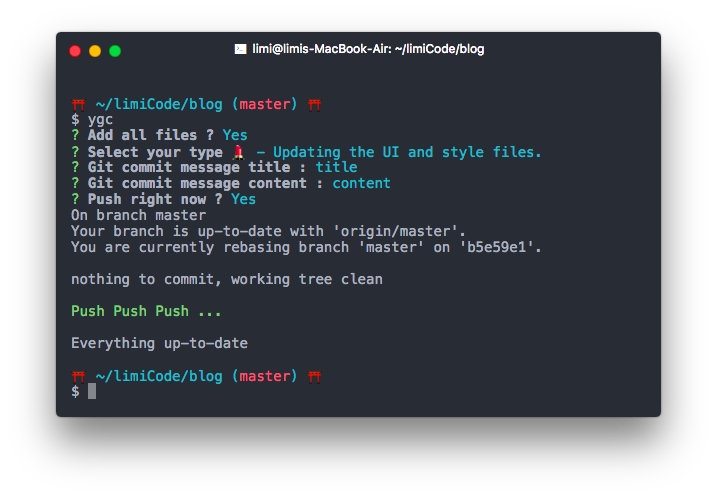

# yuki-git-commit
⛩ commit friendly

[](https://travis-ci.org/limichange/yyuki-git-commit)
[](https://github.com/limichange/yuki-git-commit)
[](https://raw.githubusercontent.com/limichange/yuki-git-commit/master/LICENSE)
[)](http://standardjs.com/)

## Install
```bash
$ npm i -g yuki-git-commit
# or
$ yarn global add yuki-git-commit
```

## Usage

Just `ygc`

```bash
$ ygc -h

  Usage: ygc [options]

  Options:

    -h, --help             output usage information
    -V, --version          output the version number
    -n, --no <items>       No <items>
    -t, --show-info-table  Show options infomation table
```

If you don't want write title or content, you can use `-n`.
```bash
$ ygc -n title,content
```

## Interactive UI
<p align="center">
  
</p>

## License
MIT © [Limichange](https://github.com/limichange)
